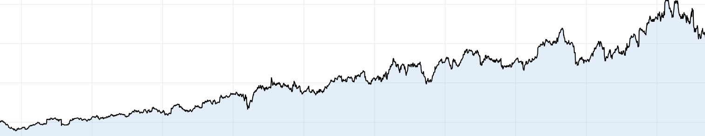

### Hi, I'm Vlad! 
#### Mathematics PhD 

Background: I completed a PhD in Mathematics at KTH Royal Institute of Technology in the summer of 2026. My research area was Probability Theory and I specialized in rare events analysis for different stochastic systems.

These days I'm exploring the world of data and modelling.

---
### Recent projects (more comming...)
* **[glm-scorecard](https://github.com/v-guskov/glm-scorecard)** - Credit Risk Scorecard Development using GLM approach

* **[financial-eda-sql](https://github.com/v-guskov/financial-eda-sql)** - SQL first analysis of financial time series 

  

 
